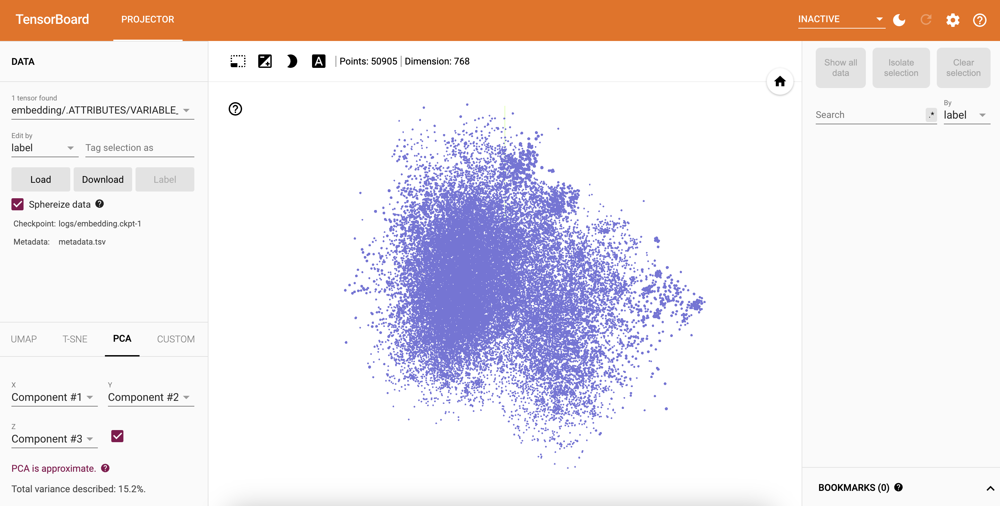

# Generative AI demo for Multi-lingual Retail application

## Backend

Source the following env variables

```
openai_api_key=
cass_user=
cass_pw=
scb_path=
keyspace=
table=
```

`pip install openai pandas numpy flask flask_cors tensorflow tensorflow_hub cassandra-driver googletrans`

```
python3 similaritySearch_openAI.py
```

## Frontend

```
npm install
npm start
```

Update `src/App.js` to point to the local backend


### Visualize embeddings

```
cd embedding-projector
tensorboard --logdir logs
```
Visit `http://localhost:6006/?darkMode=true#projector`

